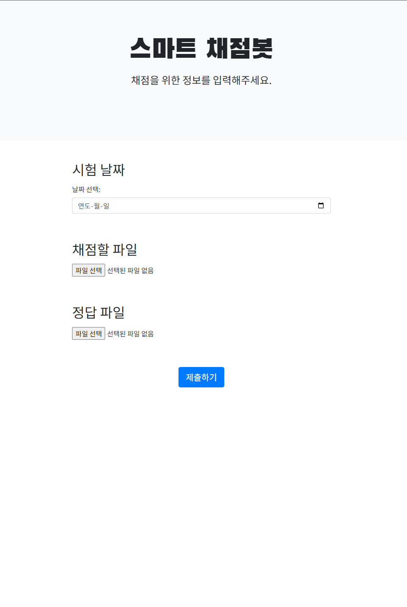

# 스마트 채점봇

>저희 프로젝트명인 스마트 채점봇은 이미지 인식을 통해 자동으로 채점해서 파일까지 만들어준다는 의미에서 지어졌습니다.

# Introduction

---
- **프로젝트 제안 배경**

    → 기존의 자동 채점 프로그램이라고 하면 OMR 기술이 있습니다. 하지만 OMR은 전용 사인펜이 필요하며 주관식 답안 작성이 불가하기에 대학 시험에서 사용하지 않습니다.
    
    → 상용화된 채점 어플리케이션 또한 객관식 문항 채점에 불과하기에 대학 시험에서 사용하기에 부적합합니다.

    → 각 문항마다의 답을 수기로 적는 방식의 대학 시험 답안지를 사람이 직접 채점하기에는 오랜 시간이 걸릴 것입니다.

    → **이러한 점을 고려하여 저희는 OCR 기술을 활용해 손글씨를 인식하고 채점해서 결과를 파일로
        반환하는 자동 채점 프로그램을 기획하게 되었습니다.** 

 

- **기대효과**

    → 수작업으로 많은 학생들의 시험지를 채점하는데 소요되는 시간을 크게 줄일 수 있습니다.
  
    → 채점에 필요한 인적 자원을 절감할 수 있습니다. 채점 인력을 줄임으로써 다른 중요한 업무에 집중할 수 있습니다.

    → 학생들은 채점 결과를 빠르게 받을 수 있어서 자신의 성취도를 즉시 확인할 수 있습니다.

    → 채점 결과를 디지털 형태로 저장해서 데이터 관리가 용이해집니다.

# Background

---
 
- **사용기술 및 배경 지식**

    → **Front**
  - HTML: 웹 페이지의 구조와 콘텐츠를 정의하는 마크업 언어입니다.
  - CSS: 웹 페이지의 스타일을 지정하는 스타일시트 언어입니다.
  - Bootstrap: 반응형 웹 디자인을 쉽게 구현할 수 있도록 도와주는 CSS 프레임워크입니다. 다양한 UI 컴포넌트를 제공하여 효율적인 웹 디자인이 가능합니다.
  - Thymeleaf: 스프링 프레임워크와 함께 사용하는 템플릿 엔진입니다. 동적인 웹 페이지를 생성할 수 있습니다.
  - Spring Boot: 스프링 프레임워크를 기반으로 한 애플리케이션 프레임워크로, 웹 애플리케이션을 빠르게 개발할 수 있게 도와줍니다.
  - JQuery: 간단하게 DOM을 조작하고, 이벤트를 처리하는 JavaScript 라이브러리입니다.

   
  
    → **Back**
  - Spring Boot: 자바 기반의 애플리케이션 프레임워크로, 웹과 플라스크 통신을 위한 서버를 구축하기 위해 사용했습니다.
  - Java: 백엔드 로직을 구현하기 위해 사용된 프로그래밍 언어입니다.
  - Apache Tomcat: 자바 서블릿을 실행하기 위한 웹 서버로, Spring Boot 애플리케이션을 배포하고 실행하는 데 사용됩니다.
  - Flask: 파이썬 기반의 경량 웹 프레임워크로, 이미지 처리를 위한 서버로 구축하기 위해 사용했습니다.
  - Python: 손글씨 인식과 채점 알고리즘을 구현하기 위해 사용된 프로그래밍 언어입니다.
  - Docker: 애플리케이션을 컨테이너화하여 배포 및 실행 환경을 일관되게 유지하는 도구입니다.

   
  
     **DB**
  - MySQL: 관계형 데이터베이스 관리 시스템(RDBMS)으로, 데이터를 효율적으로 저장하고 관리하는 데 사용됩니다.
    
   

    → **AI/ML**
  
  - _작성 예정_

 

# Design & Idea Explanation

---

- **실행 단계**

    저희 프로그램의 전체적인 실행 단계는 다음과 같습니다.

    1. 웹에서 답안지와 채점할 이미지, 날짜 입력 후 제출

    2. 손글씨 인식

    3. 인식 결과를 바탕으로 채점

    4. 채점 결과를 엑셀 파일과 이미지로 반환

 

- **기능 개요**

DB에 저장될 엔티티를 엑셀 파일과 이미지 파일 두가지로 나누어 설계했습니다.

초반 엔티티에서는 하나의 엔티티에서 fileType으로 구분

각 파일에는 파일 명과 파일에 해당하는 날짜, 데이터를 byte 타입으로 저장합니다.

→ `class diagram`

→ `e-r diagram`

 

- **프로그램 기능**

   **1. 이미지 업로드 및 날짜 제출 기능**

    * 파일 이미지는 여러 장을 한번에 선택 할 수 있습니다.
        
    * 선택한 날짜와 이미지를 한번에 제출할 수 있습니다.
          
        
    
     
  
  **2. 이미지 인식 및 자동 채점 기능**
           
    * 스프링 서버에 제출된 이미지와 해당 날짜를 플라스크 서버로 http 통신을 통해 전달합니다.
    * 답안지와 채점할 이미지 전처리 및 영역 인식 등을 통해 채점합니다.
    * 인식 및 채점된 결과를 엑셀 파일로 생성합니다.
    * 엑셀 파일과 채점된 이미지를 스프링 서버로 전달합니다.
    * 엑셀 파일과 채점된 이미지를 날짜와 함께 DB에 저장합니다.    
        (채점된 이미지 사진 추가 예정)
      
     
      
  **3. 엑셀 파일 다운로드 및 확인 기능**
        
    * 채점 결과를 확인할 날짜를 선택할 수 있습니다.
      
    * 채점 결과를 저장한 엑셀 파일을 다운로드 할 수 있습니다.
            
    * 같은 날짜에 채점을 여러번 한 경우 엑셀 파일이 여러개 생성됩니다. 해당 엑셀 파일 목록을 확인할 수 있습니다.
        
    * 엑셀 파일의 수가 많을 경우를 대비하여 collapse 기능을 통해 버튼을 누를 때 목록이 펼쳐지고 접히도록 구현했습니다.

        (결과 페이지 사진 추가 예정)
      
     

  **4. 채점 결과 이미지 확인 기능**

    * 채점된 이미지를 직접 확인하여 재검토 할 수 있습니다.

    * 이미지 파일의 수가 많을 경우를 대비하여 collapse 기능을 통해 버튼을 누를 때 목록이 펼쳐지고 접히도록 구현했습니다.

    * 이미지를 클릭하면 크게 볼 수 있습니다.

      (결과 페이지 사진 추가 예정)
  
     

 

- **시스템 환경**

- **사용자 인터페이스 디자인**

  

    
    

