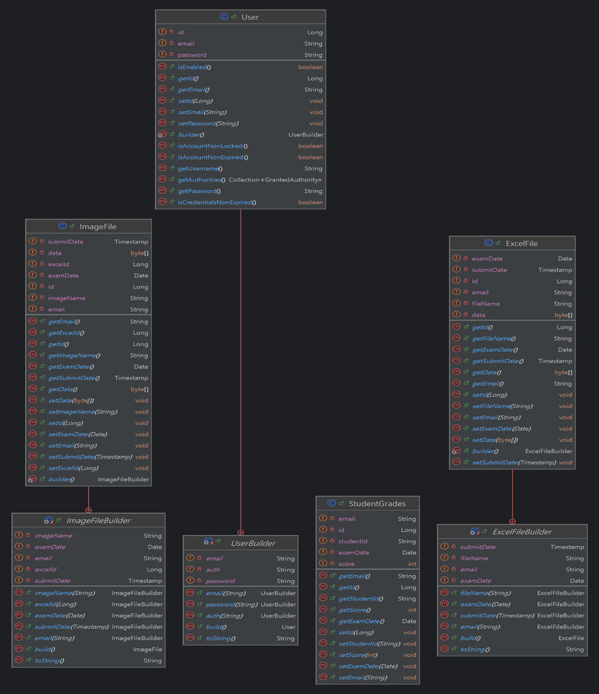
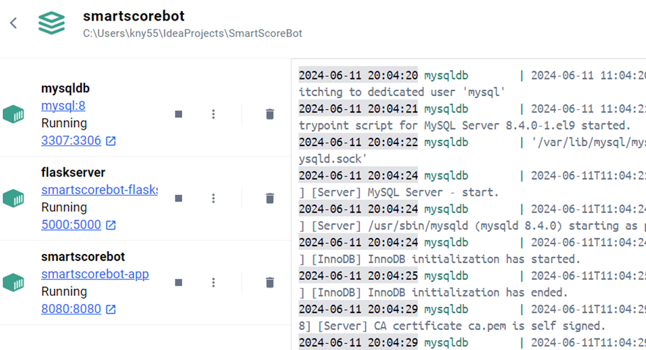

# 스마트 채점봇

>저희 프로젝트명인 스마트 채점봇은 이미지 인식을 통해 자동으로 채점해서 파일까지 만들어준다는 의미에서 지어졌습니다.

 

---

# Introduction

### :star: 프로젝트 제안 배경

→ 기존의 자동 채점 프로그램이라고 하면 OMR 기술이 있습니다. 하지만 OMR은 전용 사인펜이 필요하며 주관식 답안 작성이 불가하기에 대학 시험에서 사용하지 않습니다.

→ 상용화된 채점 어플리케이션 또한 객관식 문항 채점에 불과하기에 대학 시험에서 사용하기에 부적합합니다.

→ 각 문항마다의 답을 수기로 적는 방식의 대학 시험 답안지를 사람이 직접 채점하기에는 오랜 시간이 걸릴 것입니다.

→ **이러한 점을 고려하여 저희는 OCR 기술을 활용해 손글씨를 인식하고 채점해서 결과를 파일로
반환하는 자동 채점 프로그램을 기획하게 되었습니다.**

 

### :star: 기대효과

→ 수작업으로 많은 학생들의 시험지를 채점하는데 소요되는 시간을 크게 줄일 수 있습니다.

→ 채점에 필요한 인적 자원을 절감할 수 있습니다. 채점 인력을 줄임으로써 다른 중요한 업무에 집중할 수 있습니다.

→ 학생들은 채점 결과를 빠르게 받을 수 있어서 자신의 성취도를 즉시 확인할 수 있습니다.

→ 채점 결과를 디지털 형태로 저장해서 데이터 관리가 용이해집니다.

 

---

# Background

### :star: 사용기술 및 배경 지식
→ Front

- HTML: 웹 페이지의 구조와 콘텐츠를 정의하는 마크업 언어입니다.

    - 장점: 간단하고 배우기 쉬우며, 모든 웹 브라우저와 호환됩니다.
    - 단점: 정적 콘텐츠만을 제공하며, 복잡한 웹 애플리케이션 구현에 한계가 있습니다.
- CSS: 웹 페이지의 스타일을 지정하는 스타일시트 언어입니다.

    - 장점: HTML 문서의 스타일을 체계적으로 관리하고 재사용할 수 있습니다.
    - 단점: 복잡한 레이아웃을 구현할 때, 브라우저 간의 호환성 문제가 발생할 수 있습니다.
- Bootstrap: 반응형 웹 디자인을 쉽게 구현할 수 있도록 도와주는 CSS 프레임워크입니다. 다양한 UI 컴포넌트를 제공하여 효율적인 웹 디자인이 가능합니다.

    - 장점: 반응형 디자인을 쉽게 구현할 수 있으며, 많은 UI 컴포넌트를 제공합니다.
    - 단점: 기본 스타일이 다소 무겁고, 커스터마이징이 복잡할 수 있습니다.
- Thymeleaf: 스프링 프레임워크와 함께 사용하는 템플릿 엔진입니다. 동적인 웹 페이지를 생성할 수 있습니다.

    - 장점: HTML 파일을 서버 측에서 렌더링하여 동적인 콘텐츠를 생성할 수 있습니다.
    - 단점: 클라이언트 사이드 렌더링에 비해 반응 속도가 느릴 수 있습니다.
- Spring Boot: 스프링 프레임워크를 기반으로 한 애플리케이션 프레임워크로, 웹 애플리케이션을 빠르게 개발할 수 있게 도와줍니다.

    - 장점: 설정이 간편하고, 다양한 부가 기능을 쉽게 추가할 수 있습니다.
    - 단점: 초반 설정이 간단하지만, 복잡한 요구사항에 따라 설정이 복잡해질 수 있습니다.
- JQuery: 간단하게 DOM을 조작하고, 이벤트를 처리하는 JavaScript 라이브러리입니다.

    - 장점: 간단한 API로 복잡한 DOM 조작 및 이벤트 처리가 가능합니다.
    - 단점: 최신 프레임워크와 비교할 때 성능이 떨어질 수 있으며, 코드가 비대해질 수 있습니다.

 

→ Back

- Spring Boot: 자바 기반의 애플리케이션 프레임워크로, 웹과 플라스크 통신을 위한 서버를 구축하기 위해 사용했습니다.

    - 장점: 설정이 간단하고, 다양한 부가 기능을 쉽게 추가할 수 있습니다.
    - 단점: 대규모 프로젝트에서 설정이 복잡해질 수 있습니다.
- Java: 백엔드 로직을 구현하기 위해 사용된 프로그래밍 언어입니다.

    - 장점: 플랫폼 독립적이고, 강력한 객체 지향 프로그래밍을 지원합니다.
    - 단점: 상대적으로 느리고, 메모리 사용량이 많을 수 있습니다.
- Apache Tomcat: 자바 서블릿을 실행하기 위한 웹 서버로, Spring Boot 애플리케이션을 배포하고 실행하는 데 사용됩니다.

    - 장점: 경량화된 웹 서버로 설정 및 사용이 간편합니다.
    - 단점: 높은 트래픽을 처리할 때 성능이 저하될 수 있습니다.
- Flask: 파이썬 기반의 경량 웹 프레임워크로, 이미지 처리를 위한 서버로 구축하기 위해 사용했습니다.

    - 장점: 간단하고 유연하며, 빠르게 개발할 수 있습니다.
    - 단점: 대규모 애플리케이션에 적합하지 않으며, 확장성이 제한적일 수 있습니다.
- Python: 손글씨 인식과 채점 알고리즘을 구현하기 위해 사용된 프로그래밍 언어입니다.

    - 장점: 간결하고 읽기 쉬운 문법을 제공하며, 풍부한 라이브러리를 지원합니다.
    - 단점: 실행 속도가 느릴 수 있으며, 모바일 개발에는 적합하지 않습니다.
- Docker: 애플리케이션을 컨테이너화하여 배포 및 실행 환경을 일관되게 유지하는 도구입니다.

    - 장점: 일관된 개발 및 배포 환경을 제공하며, 애플리케이션의 이식성을 높입니다.
    - 단점: 초기 설정이 복잡할 수 있습니다.

 

→ DB

- MySQL: 관계형 데이터베이스 관리 시스템(RDBMS)으로, 데이터를 효율적으로 저장하고 관리하는 데 사용됩니다.
    - 장점: 안정적이고 성능이 우수하며, 다양한 기능을 제공합니다.
    - 단점: 대규모 데이터베이스에서 성능 문제가 발생할 수 있습니다.

   

→ **AI/ML**

- _작성 예정_

 

---

# Design & Idea Explanation

### :star: 실행 단계

프로그램의 전체적인 실행 단계는 다음과 같습니다.

    1. 웹에서 답안지와 채점할 이미지, 날짜 입력 후 제출

    2. 손글씨 인식

    3. 인식 결과를 바탕으로 채점

    4. 채점 결과를 엑셀 파일과 이미지로 반환

 

### :star: 기능 개요

DB에 저장될 엔티티를 초반에는 하나의 엔티티에서 fileType을 통해 이미지와 엑셀을 구분했으나, DB에서 파일을 불러올 때 번거로움이 있어 수정되었습니다.

→ `class diagram(초반 entity)`

 

수정 후 최종적인 entity는 엑셀 파일과 이미지 파일 두가지로 나누어 설계했습니다.
각 파일에는 파일 명과 파일에 해당하는 날짜, 데이터를 byte 타입으로 저장합니다.

→ `class diagram(최종 entity)`

→ `e-r diagram`

 

**전체적인 설계는 다음과 같습니다.**

* HttpController: 스프링과 플라스크 서버간 http통신이 이루어집니다. 스프링에서 이미지와 날짜 데이터를 플라스크로 보내면 받은 이미지를 처리 후 채점 된 이미지와 엑셀 파일을 반환합니다.

* ResultController: 시험 날짜를 parameter로 받아 날짜에 해당하는 엑셀 파일, 채점된 이미지를 프론트로 반환합니다. 또한 엑셀 파일 다운로드 버튼을 눌렀을 경우의 처리도 이 컨트롤러에서 이루어집니다.

* ImageController: 채점된 이미지 목록을 보여주기 위한 컨트롤러입니다. id를 parameter로 받아 이미지의 경로를 가져옵니다.

 

### :star: 프로그램 기능 및 요구사항

**1. 이미지 업로드 및 날짜 제출 기능**

* 파일 이미지는 여러 장을 한번에 선택 할 수 있습니다.

* 선택한 날짜와 이미지를 한번에 제출할 수 있습니다.

    

   

**2. 이미지 인식 및 자동 채점 기능**

* 스프링 서버에 제출된 이미지와 해당 날짜를 플라스크 서버로 http 통신을 통해 전달합니다.

* 답안지와 채점할 이미지 전처리 및 영역 인식 등을 통해 채점합니다.

* 인식 및 채점된 결과를 엑셀 파일로 생성합니다.

* 엑셀 파일과 채점된 이미지를 스프링 서버로 전달합니다.

* 엑셀 파일과 채점된 이미지를 날짜와 함께 DB에 저장합니다.

  (채점된 이미지 사진 추가 예정)

   

**3. 엑셀 파일 다운로드 및 확인 기능**

* 채점 결과를 확인할 날짜를 선택할 수 있습니다.

* 채점 결과를 저장한 엑셀 파일을 다운로드 할 수 있습니다.

* 같은 날짜에 채점을 여러번 한 경우 엑셀 파일이 여러개 생성됩니다. 해당 엑셀 파일 목록을 확인할 수 있습니다.

* 엑셀 파일의 수가 많을 경우를 대비하여 collapse 기능을 통해 버튼을 누를 때 목록이 펼쳐지고 접히도록 구현했습니다.

  (결과 페이지 사진 추가 예정)

   

**4. 채점 결과 이미지 확인 기능**

* 채점된 이미지를 직접 확인하여 재검토 할 수 있습니다.

* 이미지 파일의 수가 많을 경우를 대비하여 collapse 기능을 통해 버튼을 누를 때 목록이 펼쳐지고 접히도록 구현했습니다.

* 이미지를 클릭하면 크게 볼 수 있습니다.

  (결과 페이지 사진 추가 예정)

   

   

**최종적인 시스템 구상도입니다.**

docker에 Spring Boot, Mysql, Flask 이미지가 각각 빌드되어 있기 때문에 모든 작업이 docker 컨테이너 내에서 실행됩니다.

 

### :star: 시스템 환경

* 개발 환경
    * OS: Window
    * docker 3.8
    * Mysql 8
    * Spring Boot 3.0.2
    * jdk 17
    * Flask 3.12

* 프로그램 실행 환경
    * Docker container에서 실행
      

 

### :star: 사용자 인터페이스 디자인

 

---

# Design Limited Factors

### :star: 설계 제한 요소

다음은 저희가 프로젝트를 개발하면서 직면할 수 있는 잠재적인 문제점이나 제한 요소, 이를 해결하기 위한 방안입니다.

1. 성능 제한
    - 실시간 처리 속도: 손글씨를 인식하고 채점하는 프로세스는 여러 이미지 파일을 동시에 처리해야 하기 때문에 처리 속도가 중요한 제한 요소입니다. 이를 위해 이미지 전처리, 인식, 채점 알고리즘을 최적화하려고 시도 중에 있습니다.

2. 기술적 제한
    - OCR 정확도: 다양한 필체와 글씨 크기를 인식하는데 있어서 OCR 기술의 한계가 있을 수 있습니다. 이 정확도를 높이기 위해 ????

3. 호환성 제한
    - 운영 체제 호환성: 개발 및 배포 환경에 따라 운영체제가 달라 호환성 문제가 발생할 수 있습니다. 이를 방지하기 위해 docker에 이미지를 빌드, 컨테이너를 실행하는 방식을 사용합니다.

4. 사용성 제한
    - 사용자 인터페이스: UI디자인은 직관적이고 사용하기 쉬워야 합니다. 이를 위해 주변 지인들이 사용해보도록 하고 피드백을 반영하여 디자인을 변경하고 결과 페이지를 한 눈에 보기 쉽도록 수정하였습니다.

 

