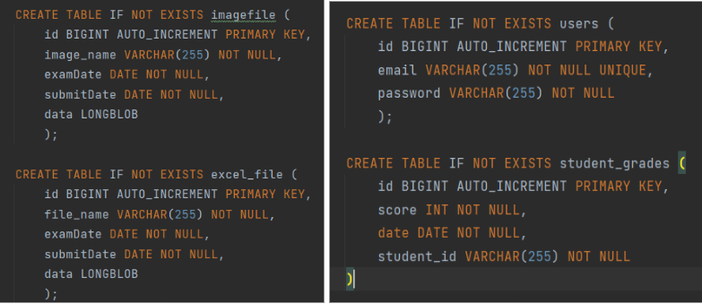
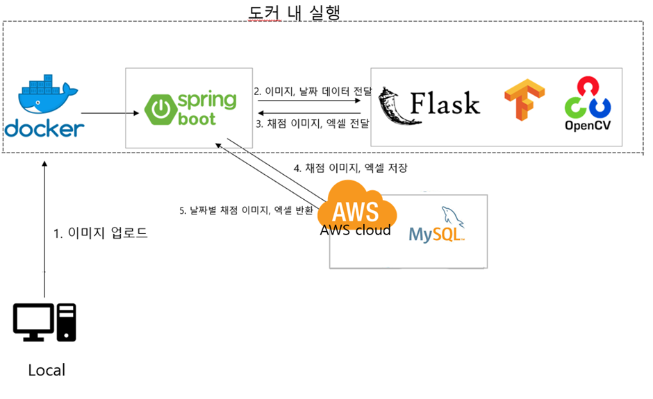

# 스마트 채점봇


>저희 프로젝트명인 스마트 채점봇은 이미지 인식을 통해 자동으로 채점해서 파일까지 만들어준다는 의미에서 지어졌습니다.<br/>

>readme작성자: 김나연(frontend, spring 서버, flask 서버 구축 담당)

<br/>

---

# Introduction


### :star: 프로젝트 제안 배경

→ 기존의 자동 채점 프로그램이라고 하면 OMR 기술이 있습니다. 하지만 OMR은 전용 사인펜이 필요하며 주관식 답안 작성이 불가하기에 대학 시험에서 사용하지 않습니다.

→ 상용화된 채점 어플리케이션 또한 객관식 문항 채점에 불과하기에 대학 시험에서 사용하기에 부적합합니다.

→ 각 문항마다의 답을 수기로 적는 방식의 대학 시험 답안지를 사람이 직접 채점하기에는 오랜 시간이 걸릴 것입니다.

→ **이러한 점을 고려하여 저희는 OCR 기술을 활용해 손글씨를 인식하고 채점해서 결과를 파일로
반환하는 자동 채점 프로그램을 기획하게 되었습니다.**

<br/>

### :star: 기대효과

→ 수작업으로 많은 학생들의 시험지를 채점하는데 소요되는 시간을 크게 줄일 수 있습니다.

→ 채점에 필요한 인적 자원을 절감할 수 있습니다. 채점 인력을 줄임으로써 다른 중요한 업무에 집중할 수 있습니다.

→ 학생들은 채점 결과를 빠르게 받을 수 있어서 자신의 성취도를 즉시 확인할 수 있습니다.

→ 채점 결과를 디지털 형태로 저장해서 데이터 관리가 용이해집니다.

<br/>


---

# Background


### :star: 사용기술 및 배경 지식
→ Front

- HTML: 웹 페이지의 구조와 콘텐츠를 정의하는 마크업 언어입니다.

    - 장점: 간단하고 배우기 쉬우며, 모든 웹 브라우저와 호환됩니다.
    - 단점: 정적 콘텐츠만을 제공하며, 복잡한 웹 애플리케이션 구현에 한계가 있습니다.
- CSS: 웹 페이지의 스타일을 지정하는 스타일시트 언어입니다.

    - 장점: HTML 문서의 스타일을 체계적으로 관리하고 재사용할 수 있습니다.
    - 단점: 복잡한 레이아웃을 구현할 때, 브라우저 간의 호환성 문제가 발생할 수 있습니다.
- Bootstrap: 반응형 웹 디자인을 쉽게 구현할 수 있도록 도와주는 CSS 프레임워크입니다. 다양한 UI 컴포넌트를 제공하여 효율적인 웹 디자인이 가능합니다.

    - 장점: 반응형 디자인을 쉽게 구현할 수 있으며, 많은 UI 컴포넌트를 제공합니다.
    - 단점: 기본 스타일이 다소 무겁고, 커스터마이징이 복잡할 수 있습니다.
- Thymeleaf: 스프링 프레임워크와 함께 사용하는 템플릿 엔진입니다. 동적인 웹 페이지를 생성할 수 있습니다.

    - 장점: HTML 파일을 서버 측에서 렌더링하여 동적인 콘텐츠를 생성할 수 있습니다.
    - 단점: 클라이언트 사이드 렌더링에 비해 반응 속도가 느릴 수 있습니다.
- Spring Boot: 스프링 프레임워크를 기반으로 한 애플리케이션 프레임워크로, 웹 애플리케이션을 빠르게 개발할 수 있게 도와줍니다.

    - 장점: 설정이 간편하고, 다양한 부가 기능을 쉽게 추가할 수 있습니다.
    - 단점: 초반 설정이 간단하지만, 복잡한 요구사항에 따라 설정이 복잡해질 수 있습니다.
- JQuery: 간단하게 DOM을 조작하고, 이벤트를 처리하는 JavaScript 라이브러리입니다.

    - 장점: 간단한 API로 복잡한 DOM 조작 및 이벤트 처리가 가능합니다.
    - 단점: 최신 프레임워크와 비교할 때 성능이 떨어질 수 있으며, 코드가 비대해질 수 있습니다.

<br/>

→ Back

- Spring Boot: 자바 기반의 애플리케이션 프레임워크로, 웹과 플라스크 통신을 위한 서버를 구축하기 위해 사용했습니다.

    - 장점: 설정이 간단하고, 다양한 부가 기능을 쉽게 추가할 수 있습니다.
    - 단점: 대규모 프로젝트에서 설정이 복잡해질 수 있습니다.
- Java: 백엔드 로직을 구현하기 위해 사용된 프로그래밍 언어입니다.

    - 장점: 플랫폼 독립적이고, 강력한 객체 지향 프로그래밍을 지원합니다.
    - 단점: 상대적으로 느리고, 메모리 사용량이 많을 수 있습니다.
- Apache Tomcat: 자바 서블릿을 실행하기 위한 웹 서버로, Spring Boot 애플리케이션을 배포하고 실행하는 데 사용됩니다.

    - 장점: 경량화된 웹 서버로 설정 및 사용이 간편합니다.
    - 단점: 높은 트래픽을 처리할 때 성능이 저하될 수 있습니다.
- Flask: 파이썬 기반의 경량 웹 프레임워크로, 이미지 처리를 위한 서버로 구축하기 위해 사용했습니다.

    - 장점: 간단하고 유연하며, 빠르게 개발할 수 있습니다.
    - 단점: 대규모 애플리케이션에 적합하지 않으며, 확장성이 제한적일 수 있습니다.
- Python: 손글씨 인식과 채점 알고리즘을 구현하기 위해 사용된 프로그래밍 언어입니다.

    - 장점: 간결하고 읽기 쉬운 문법을 제공하며, 풍부한 라이브러리를 지원합니다.
    - 단점: 실행 속도가 느릴 수 있으며, 모바일 개발에는 적합하지 않습니다.
- Docker: 애플리케이션을 컨테이너화하여 배포 및 실행 환경을 일관되게 유지하는 도구입니다.

    - 장점: 일관된 개발 및 배포 환경을 제공하며, 애플리케이션의 이식성을 높입니다.
    - 단점: 초기 설정이 복잡할 수 있습니다.

<br/>

→ DB

- MySQL: 관계형 데이터베이스 관리 시스템(RDBMS)으로, 데이터를 효율적으로 저장하고 관리하는 데 사용됩니다.
    - 장점: 안정적이고 성능이 우수하며, 다양한 기능을 제공합니다.
    - 단점: 대규모 데이터베이스에서 성능 문제가 발생할 수 있습니다.
- AWS RDS: Amazon Web Services의 관계형 데이터베이스 서비스로, MySQL 데이터베이스를 클라우드에서 호스팅하여 확장성과 안정성을 제공합니다.


  <br/>

→ OCR

- Tesseract : 다양한 운영체제에 사용할 수 있는 오픈소스 광학 문자 인식 엔진으로 인쇄된 문자 영역의 인식을 위해 사용됩니다.
- OpenCV : 영상 처리에 사용할 수 있는 오픈 라이브러리이며 BSD(Berkely Software Distribution)라이선스를 따르며 현 구현에서 손글씨 이미지의 원활한 인식을 위한 전처리 작업에 활용됩니다.
- Tensorflow : 구글 브레인 팀에서 개발한 오픈소스 머신러닝 및 딥러닝 프레임워크. 손글씨 인식을 위한 Mask RCNN의 개발에 활용됩니다.


<br/>

---

# Design & Idea Explanation


### :star: 실행 단계

프로그램의 전체적인 실행 단계는 다음과 같습니다.

    1. 스마트 채점봇 웹사이트에서 이메일 인증 회원가입 및 로그인을 한다.
    2. 채점 파일과 답안지 파일을 스캔하여 디지털 형식으로 변환하여 준비한다.
    3. 해당 이미지 파일과 날짜를 입력 후 업로드한다.
    4. 답안지 이미지 파일이 전처리 및 인식 과정을 거친다.
    5. OCR로 인식한 결과와 답안을 비교해서 채점을 진행한다.
    6. 채점된 이미지와 채점 결과 엑셀 파일이 반환된다.
    7. 회원 별로 채점된 기록을 갖고 이를 관리 및 검색할 수 있다.


<br/>

### :star: 기능 개요

대체적인 기능 개요는 다음과 같습니다.
```
**데이터 관리 측면**
데이터 수집 및 전처리 : 시험지 이미지는 스캔된 이미지 파일 형식으로 수집되며 클라우드 스토리지에 저장된다. 이미지 품질 향상을 위해 노이즈 제거, 밝기 및 대비 조정, 기울기 보정 등을 수행한다.
데이터 저장 구조 : 데이터들을 체계적으로 저장하고 관리하기 위해 관계형 DB를 사용하여 시험지 정보, 학생 답안, 정답 정보, 점수 정보 등을 저장하고 관리한다. 확장성을 고려하여 대량의 데이터를 효율적으로 관리하기 위해 클라우드 기반 데이터베이스를 사용한다.
데이터 보안 : 접근 권한을 관리하기 위해 사용자 계정을 사용하고, 자신의 계정 데이터에만 접근할 수 있도록  데이터 접근 권한을 제한한다.

**이미지 모델 측면**
이미지 입력 및 전처리 : 왜곡되거나 흐릿함, 어두운 이미지를 방지하기 위해 스캔된 이미지로만 입력받도록 한다. 입력된 이미지들은 정규화 과정을 통해 그레이스케일로 변환하여 처리 속도와 모델 성능을 최적화한다.
OCR 엔진 : OpenCV를 활용한 이미지 전처리 과정을 거쳐 tensorflow 기반으로 구현된 백본으로 VGG가 사용된 간략화된 Mask RCNN 모델로 손글씨 영역을 인식하며 답안 영역의 인식은 tesseract를 활용한다.
손글씨 인식을 위한 딥러닝 모델 : 손글씨 영역에 대한 검출 모델과 해당 검출된 영역의 인식을 end-to-end로 진행하는 Mask RCNN의 간단한 구현으로 손글씨 영역 부분에 적혀진 객관식 답안의 인식을 수행한다.
모델 학습 및 튜닝 : Mask RCNN 학습을 위해 다양한 글씨체에 대한 인식을 위해 MNIST 데이터셋을 가지고 임의의 256 x 256 크기의 이미지 안에 분포시킨 학습 데이터를 가지고 검출 및 인식 학습을 수행한다.
모델 평가 : 최종 테스트는 실제로 작성한 시험지를 사용해서 테스트를 수행하며, 이미지 품질 및 입력 조건에 따른 모델의 강건성을 확인한다. 텍스트 인식 정확도(Precision, Recall), 채점의 정확도와 신뢰도를 기준으로 모델 성능을 평가한다.
이미지 모듈화 : 이미지 전처리, 텍스트 인식, 채점 결과 분석을 모듈화하여, 각 컴포넌트의 독립적인 개선이 가능하도록 설계한다.

**사용자 편의성**
로그인 / 아웃, 계정 생성, 비밀번호 찾기
데이터베이스 접근권한 관리 및 채점 기록 관리
데이터의 저장 및 백업을 효율적으로 관리 UI (클라우드 연결)
```


최종적인 entity 구성은 flask 서버에서 받아오는 데이터 파일을 저장할 엑셀 파일, 이미지 파일과 회원 정보를 저장할 테이블, 학생 점수를 저장할 테이블로 나누어 설계하였습니다.
이미지 파일과 엑셀 파일에는 파일 명과 데이터를 byte 타입으로 저장하며 채점 기록 및 날짜로 검색하기 위한 채점 날짜와 시험 날짜를 date 타입으로 저장합니다. 유저 테이블은 회원가입시 이메일과 비밀번호 정보가 저장되며 점수 테이블은 학생 점수와 시험 날짜, 채점 날짜, 학번 정보가 저장됩니다.




→ `entity 구성 DB 스키마`

<br/>

전체적인 설계는 다음과 같습니다.


→ `전체 구성 클래스 다이어그램`



→ `최종적인 시스템 설계 구상도`

<br/>

**본 프로젝트는 다음과 같은 기능을 제공합니다**

1. 회원가입 및 로그인, 로그아웃 기능
2. 이미지 업로드 및 날짜 제출 기능
3. 이미지 인식 및 자동 채점 기능
4. 엑셀 파일 다운로드 및 채점 이미지, 점수 통계 확인 기능
5. 채점 기록 확인 및 관리 기능


<br/>

### :star: 프로그램 기능 및 요구사항

**1. 회원가입 및 로그인, 로그아웃 기능**

회원 관리를 원활하게 하기 위해 단국대학교 계정을 통해 회원가입을 진행합니다. 회원가입은 이메일(단국대학교 계정), 비밀번호, 이메일 인증을 통해 가능합니다. 로그인은 이메일과 비밀번호를 사용하며, 자동 로그인 버튼을 통해 3일 동안 자동 로그인을 유지할 수 있습니다.
로그인 후에만 채점 기능, 채점 결과 확인 기능, 채점 기록 확인 기능을 사용할 수 있습니다.

**2. 비밀번호 찾기 기능**

비밀번호를 잊어버리는 상황에 대비해 비밀번호 찾기 기능을 제공합니다. 회원가입 시 사용했던 이메일 정보를 입력하면 이메일 인증을 통해 비밀번호를 변경할 수 있습니다.

**3. 이미지 업로드 및 날짜 제출 기능**

여러 장의 이미지 파일을 한 번에 업로드할 수 있습니다. 사용자는 시험 날짜, 채점 파일, 정답 파일을 함께 제출하며, 제출 날짜와 시간이 기록됩니다.

**4. 이미지 인식 및 자동 채점 기능**

스프링 서버는 제출된 이미지, 시험 날짜, 제출 날짜 정보를 플라스크 서버로 전달합니다.
플라스크 서버는 정답 파일과 채점 이미지 파일을 전처리하고 영역 인식을 수행한 뒤, 구현된 모델을 통해 자동으로 채점을 진행합니다.
채점 결과는 엑셀 파일과 이미지 파일로 생성되어 스프링 서버로 전달됩니다.
이후, 결과는 AWS 클라우드(MySQL) DB에 날짜와 함께 저장됩니다.

**5. 엑셀 파일 다운로드 및 채점 이미지, 점수 통계 확인 기능**

채점이 완료된 후, 결과 확인 페이지로 이동합니다.

- 채점 결과가 저장된 엑셀 파일을 다운로드할 수 있습니다.
- 채점 이미지를 확인하고 점수 통계 표를 열람할 수 있습니다.
- 많은 데이터를 효과적으로 관리하기 위해 collapse 기능을 활용하여 버튼 클릭 시 목록이 펼쳐지고 접힐 수 있습니다.
- 채점된 이미지를 클릭하면 확대된 뷰를 통해 재검토할 수 있습니다.

**6. 채점 기록 확인 및 관리 기능**

화면 상단 바의 채점 기록 확인 버튼을 통해 접근할 수 있으며, 로그인한 회원만 사용할 수 있습니다.

- 채점 기록은 제출 순서 또는 시험 날짜 순서로 나열 가능합니다.
- 특정 기록을 영구 삭제하거나, 상세보기 버튼을 통해 해당 기록의 엑셀 파일, 이미지, 점수 통계를 확인할 수 있습니다.
- 날짜별 검색 기능을 통해 특정 날짜에 해당하는 채점 기록을 한 번에 열람할 수 있습니다.

  <br/>

  <br/>

<br/>

### :star: 시스템 환경

* 개발 환경
    * OS: Window
    * docker 3.8
    * Mysql 8
    * Spring Boot 3.0.2
    * jdk 17
    * Flask 3.12

* 의존성
  - spring-boot-starter-web: REST API 개발
  - spring-boot-starter-data-jpa: JPA 기반 DB 연동
  - spring-boot-starter-thymeleaf: Thymeleaf 템플릿 엔진
  - spring-boot-starter-mail: 이메일 발송
  - spring-boot-starter-security: 인증 및 권한 부여
  - thymeleaf-extras-springsecurity: Thymeleaf와 Spring Security 통합
  - lombok: 보일러플레이트 코드 최소화
  - mysql-connector-j: MySQL 연결


* 프로그램 실행 환경
    * Docker container에서 실행
      


<br/>


### :star: 사용자 인터페이스 디자인


<br/>

---

# Design Limited Factors

### :star: 설계 제한 요소

다음은 프로젝트 진행 중 직면할 수 있는 잠재적인 문제점과 제한 요소, 그리고 이를 해결하기 위한 방안에 대해 설명한 내용입니다.

1. 성능 제한
   - 실시간 처리 속도: 손글씨를 인식하고 채점하는 프로세스는 여러 이미지 파일을 동시에 처리해야 하므로, 처리 속도가 중요한 제한 요소입니다. 이에 AWS 클라우드 서버를 사용하여 성능과 비용 간의 타협점을 설정했습니다.
   - 정확도: OCR의 정확도는 시험지의 글자 크기, 글씨체, 이미지 품질, 손글씨의 가독성 등에 의해 영향을 받습니다. 특히 손글씨를 정확히 인식하지 못하면 채점 결과의 신뢰도가 떨어질 수 있습니다. 이를 해결하기 위해 MNIST와 직접 수집한 손글씨 데이터를 모델 학습에 사용하여 손글씨 인식의 정확도를 높이고자 했습니다.

2. 기술적 제한
    - OCR 정확도: 다양한 필체와 글씨 크기를 인식하는 데 정확도 문제가 있을 수 있습니다. 특히 손글씨는 글씨체에 따라 인식률이 크게 달라지며, 난독성 높은 글씨체나 비슷하게 생긴 글자 종류, 또는 특수 문자 형태는 OCR 엔진에서 인식하기 어렵습니다. 이를 해결하기 위해 MNIST에 타원형을 합성한 변형 데이터셋 등을 활용하여 변칙적인 표기법에 대해서도 인식할 수 있도록 학습을 진행했습니다.
    - 보안 및 개인정보 보호: 시험지에는 학생의 개인정보와 시험 결과 등 민감한 데이터가 포함될 수 있기 때문에 보안 요소는 매우 중요합니다. 클라우드 환경을 사용하는 동시에 계정 로그인 방식을 통해 사용자를 인증하고자 했습니다.
    - 언어 및 문자 제한: 여러 언어를 사용하는 경우 OCR의 성능이 크게 저하될 수 있습니다. 그러나 이 프로젝트는 숫자 답안과 한글 이름만 존재하므로 다중 언어 문제는 발생하지 않았습니다.

3. 호환성 제한
    - 운영 체제 호환성: 개발 및 배포 환경에 따라 운영체제가 달라 호환성 문제가 발생할 수 있습니다. 이를 방지하기 위해 docker에 이미지를 빌드, 컨테이너를 실행하는 방식을 사용합니다.

4. 사용성 제한
    - 사용자 인터페이스: UI디자인은 직관적이고 사용하기 쉬워야 합니다. 이를 위해 주변 지인들이 사용해보도록 하고 피드백을 반영하여 디자인을 변경하고 결과 페이지를 한 눈에 보기 쉽도록 수정하였습니다.

<br/>

### :star: 성능 평가

다음은 학습시킨 CNN 모델을 로드하여 손글씨 550개의 답안지를 인식했을 때의 인식 성능입니다.

[Validation Accuracy 이미지]
76.63%로 Validation Accuracy가 기대보다 낮게 나왔는데, 이는 모델이 표와 결합된 상태에서 숫자를 바로 인식하도록 하기 위해 6만 장의 MNIST 이미지를 학습시킨 모델이라 영향을 미쳤을 가능성이 있습니다. 또한 크기가 과도하게 작은 숫자 이미지의 경우 (28x28) 크기에 맞추기 위해 사이즈를 변환하는 과정에서 이미지가 흐려지고 왜곡이 발생했을 수 있습니다. 이러한 요소도 정확도에 영향을 미쳤을 것으로 예상됩니다. 실제 프로그램에서 모델을 사용할 때는 전처리 과정 중 스케일 조정을 통해 정확도를 높이는 방향으로 개발할 예정입니다. 또한 현재 테이블 추출 문제로 인해 선분이 포함된 이미지를 모델에 학습시켰으나, 이미지 처리 과정에서 테이블 추출 문제를 해결한다면 모델을 폐기하고 선분이 없는 손글씨에 대한 학습을 다시 진행할 예정입니다.

[혼동 행렬 이미지]
이 그래프는 학습시킨 CNN 모델의 혼동 행렬입니다. 2의 인식 정확도가 가장 높았으며, 0과 9는 상대적으로 낮은 positive 값을 가지는 것을 확인할 수 있습니다. 현재 상대적으로 낮은 값을 가지는 클래스들에 대해 추가적인 표본을 확보하고 다시 학습하여 성능을 향상시킬 예정입니다. 다만, 550개의 데이터가 클래스별로 불균등하게 분포되어 있기 때문에 9처럼 표본이 적은 클래스의 경우 신뢰도가 높지 않을 수 있습니다. 3과 2가 단국대학교 재학생 특성상 고정적으로 포함되어 표본이 치우친 점도 영향을 미친 것으로 보입니다. 표본이 적은 클래스는 추가 표본을 수집하여 다시 학습하고 검증을 진행할 필요가 있습니다.


[무작위 샘플 실제 값/예측 값 비교 이미지]
이 표는 검증에 사용된 데이터 중 무작위로 10개를 선택하여 CNN 모델이 예측한 값과 실제 값의 비교를 보여줍니다. 이를 통해 모델이 어떻게 잘못 인식했는지를 확인할 수 있습니다.

